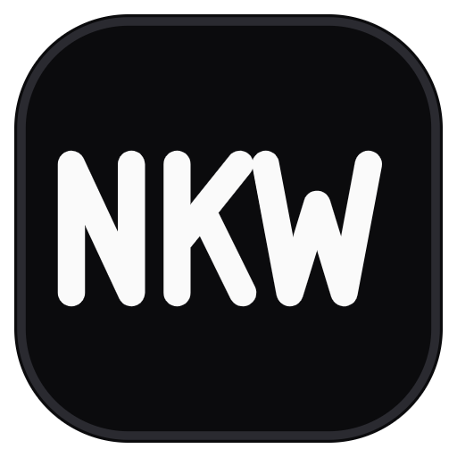

<div align="center">



# NKW Mod Studio

**Make Minecraft mods by connecting nodes (Unreal Blueprint style) — no code required.**

by **Nam Kueap Wan (NKW)**

[License: zlib](LICENSE)

</div>

> [!WARNING]
> **This project is 100% AI-generated.**
> All source code, documentation, tests and assets in this repository were written by an AI (Anthropic's Claude) from the NKW team's instructions. It has been tested (see [Verification](#verification)), but it has **not** been reviewed line-by-line by a human developer. It may contain bugs or unexpected behavior — use it at your own risk and back up your projects and worlds.

---

## Features

| Area | What you can make |
|---|---|
| 💎 Items | Items, food, tools & weapons (sword, pickaxe, axe, shovel, hoe), tool materials, 3D items (3D in hand with an optional 2D inventory icon), items that place blocks (e.g. seeds → crop) |
| 🧱 Blocks | Cube blocks (all sides / top-side-bottom / pillar), **3D blocks** from Blockbench (hitbox computed from the model, faces the player), custom drops |
| 🛡 Armor | Armor materials + **individual armor pieces** (helmet / chestplate / leggings / boots), 2D or **3D with GeckoLib** including animations |
| ✨ Effects | 30 status effects, level 1–1000, infinite duration, toggle particles and status icon — on food (when eaten), weapons (on hit) and armor (while worn) |
| 🎞 Animation | Animated textures, looping GeckoLib animations on 3D armor |
| 🎵 Sound | Sound files, sound events, **music discs** (length taken from the audio file, copyright label, optional loop), built-in **MP3 / WAV / MP4 / … → OGG converter** |
| 🍳 Recipes | Shaped crafting with a drag & drop 3×3 grid, shapeless crafting, furnace / blast furnace / smoker / campfire, stonecutter, smithing table |
| 🍲 Farmer's Delight | Cutting board and cooking pot recipes (the skillet uses campfire recipes); Farmer's Delight is added automatically when testing |
| 🗂 Creative tabs | Multiple tabs with a logo icon; wire any items into a tab (items not in a tab can be obtained with `/give`) |
| 📦 Game items | Every Minecraft and Farmer's Delight item of each version with icons and tags, grouped by what they are used for — drag them in as ingredients |

**Easy to use:** drag & drop files anywhere · VS Code–style asset tree (folders, rename, move, delete to Recycle Bin) · box selection · undo/redo · autosave · live problem checking · light/dark theme following the system · Thai and English UI · custom mod logo

**Test in game with one click:** press ▶ and the app generates a Gradle project, downloads the Java/Gradle it needs (asks first, checksum-verified) and launches Minecraft with your mod (Fabric/Quilt also get Fabric API + Mod Menu). Or press ⬇ to export a `.jar`.

## Supported loaders and versions

| Minecraft | Fabric | Quilt | Forge | NeoForge |
|---|:-:|:-:|:-:|:-:|
| 1.21.4 | ✓ | ✓ | ✓ | ✓ |
| 1.21.1 | ✓ | ✓ | ✓ | ✓ |
| 1.20.4 | ✓ | ✓ | ✓ | ✓ |
| 1.20.1 | ✓ | ✓ | ✓ | – |
| 1.19.2 | ✓ | ✓ | ✓ | – |
| 1.18.2 | ✓ | ✓ | ✓ | – |
| 1.16.5 | ✓ | – | ✓ | – |

- Farmer's Delight: Forge 1.18.2–1.20.1, NeoForge 1.21.1, Fabric/Quilt 1.20.1 and 1.21.1
- 3D armor (GeckoLib): 1.20.1 and 1.21.1 (other versions fall back to 2D armor automatically)
- Minecraft 26.x is not supported yet
- New versions can be added in `src/core/gen/profiles.ts`

## Build from source

Requires [Node.js](https://nodejs.org/) 20.19+ (22 LTS or newer recommended) and Git. Windows 10/11 64-bit is the tested platform.

```bash
git clone https://github.com/Maskbuild/NKW-Mod-Studio.git
cd NKW-Mod-Studio
npm install
npm run dev
```

| Command | What it does |
|---|---|
| `npm run dev` | Run the app in development mode (hot reload) |
| `npm run build` | Build the app |
| `npm run dist` | Create the Windows installer in `dist/` |
| `npm test` | Unit tests |
| `npm run typecheck` | TypeScript check |
| `npx tsx scripts/verify-matrix.ts build [fabric-1.21.1 …]` | Build a sample mod that uses every node with real Gradle, for every loader × version |
| `npx tsx scripts/smoke-client.ts fabric-1.21.1` | Launch real Minecraft to check that the sample mod loads |

> npm 11 may ask you to allow the install scripts of `electron`, `esbuild` and `ffmpeg-static`: `npm approve-scripts electron esbuild ffmpeg-static`

## Project structure

```
src/core      node graph → IR → validation → Java/JSON generators (shared by main + web worker)
  gen/profiles.ts   API differences per Minecraft version (add new versions here)
src/main      Electron main process: IPC, projects, asset import/conversion, Java/Gradle, game launch
src/preload   allowlisted IPC bridge
src/renderer  React UI (home, node canvas, properties panel, 3D preview)
scripts       test fixture + real build / in-game test scripts
tests         unit tests (vitest)
```

## Verification

What the AI-generated code was checked with:

- 38 unit tests (compiler, generators for every loader × version, Blockbench conversion, path-traversal protection, audio import)
- **Real Gradle builds of a sample mod using every node: 23/23 loader × version targets pass** (compile + `.jar`)
- **Minecraft actually launched** with the sample mod on Fabric, Quilt, Forge and NeoForge across 1.16.5–1.21.4 — mod registered, no model/texture errors
- Recipe, loot table, tag, jukebox song and equipment JSON checked against the real vanilla and Farmer's Delight files

Not tested automatically: behavior inside a world (crafting, placing blocks, effects), drag & drop from the OS. Please test these yourself.

## Security

- Electron with `contextIsolation` + `sandbox`, no `nodeIntegration`, strict CSP, Electron Fuses
- Allowlisted IPC channels, every payload validated with zod
- All file access confined to the project folder, atomic saves + 10 backups, deleting moves files to the Recycle Bin
- Downloads only from official sources (Mojang, Adoptium, Gradle, Fabric/Quilt/Forge/NeoForge, Modrinth) over HTTPS with checksum verification

## License

**[zlib License](LICENSE)** — Copyright © 2026 Nam Kueap Wan (NKW)

In short (the [LICENSE](LICENSE) file is the legally binding text):

- ✅ Free to use, including commercially
- ✅ Modify, customize, build on it and redistribute it
- ✅ **No credit required** (appreciated, though)
- ❌ **Do not claim that you wrote the original software**
- ❌ Modified versions you distribute must be clearly marked as modified and must not be presented as the original
- ❌ Do not remove the license notice from distributed source code

Mods you make with this app are yours — license them however you like.

> Minecraft is a trademark of Mojang Studios / Microsoft. NOT AN OFFICIAL MINECRAFT PRODUCT. NOT APPROVED BY OR ASSOCIATED WITH MOJANG OR MICROSOFT.
